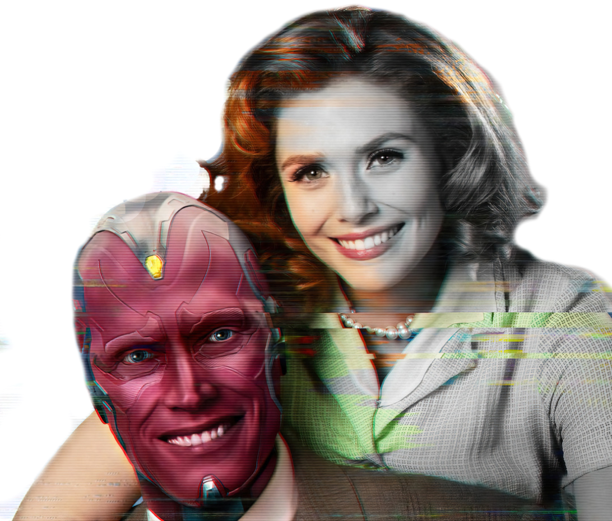

<div align="center" >
  
  
</div>

<!-- ************************************* Baadges ********************************************* -->
<p align="center">
  

 

  <a href="https://github.com/tgmarinho/nlw1/commits/master">
    
  </a>
</p>

<!-- ************************************* Título ********************************************* -->

<h1> :computer: FrontWeek - Wandavision Project</h1>

<!-- ************************************* Sobre o projeto ********************************************* -->

<h2>:revolving_hearts: Sobre o Projeto</h2>

<p> Projeto do Site Web da série Wandavision do Disney+, site desenvolvido utilizando HTML5, SCSS e Javascript, totalmente responsivo, com um visual de encher os olhos e movimentos fluídos.</p>

---

<h3>📚 Linguagens / Frameworks / Bibliotecas</h3>

* HTML
* CSS 
* SASS
* HTML 
* JavaScript
* JQuery
* [TiltJs](https://gijsroge.github.io/tilt.js/) - Biblioteca para dar o efeito parallax.  
* [TweenMax](https://greensock.com/docs/v2/TweenMax) - Biblioteca que contem a funcionalidade de execução de timeline.
* [SVG Inject](https://github.com/iconfu/svg-inject) - Biblioteca para injetar arquivos SVG. 
* [Google Fonts](https://fonts.google.com/) - Fontes para o projeto.


<h3>🧰 Ferramentas</h3>

* [Figma](https://www.figma.com/) - Ferramenta para design de Interfaces.S 
* [Visual Studio Code](https://code.visualstudio.com/) - IDE de Desenvolvimento. 
  * [Live Sass Compiler](https://marketplace.visualstudio.com/items?itemName=ritwickdey.live-sass) -  Extensão do vscode para compilar o arquivo Sass e gerar style em css


<h2>🖼️ Imagens do Projeto</h2>

<div align="center" >
  
</div>

</br>

<h3> 🎲 Rodando o Projeto</h3>

```bash
# Clone este repositório
$ git clone https://github.com/limaCoder/wandavision.git

# Acesse a pasta do projeto
$ cd wandavision

# execute o arquivo
./index.html
```

<h3 id="referencias"> ⚓ Referências</h3>

* [Násser Yousef](https://www.instagram.com/nasser.yousefali/) - Semana FrontWeek

---
⌨️ com ❤️ por [Mario Lima](https://gist.github.com/limaCoder) 😊
